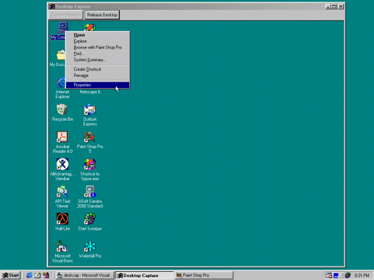



## Move The Desktop Into A Form

### Description

This code moves the desktop into a PictureBox on a form. This code can be applied to other things as well, such as hiding the "pay-to-surf" bars or free internet ads. Enjoy!
 
### More Info
 

             |
---                |---
**Submitted On**   |2000-05-28 20:30:24
**By**             |[Will Brendel](https://github.com/Planet-Source-Code/PSCIndex/blob/master/ByAuthor/will-brendel.md)
**Level**          |Advanced
**User Rating**    |5.0 (10 globes from 2 users)
**Compatibility**  |VB 5\.0, VB 6\.0
**Category**       |[Miscellaneous](https://github.com/Planet-Source-Code/PSCIndex/blob/master/ByCategory/miscellaneous__1-1.md)
**World**          |[Visual Basic](https://github.com/Planet-Source-Code/PSCIndex/blob/master/ByWorld/visual-basic.md)
**Archive File**   |[CODE\_UPLOAD62005282000\.zip](https://github.com/Planet-Source-Code/will-brendel-move-the-desktop-into-a-form__1-8435/archive/master.zip)

### API Declarations

Included in the zip file...

